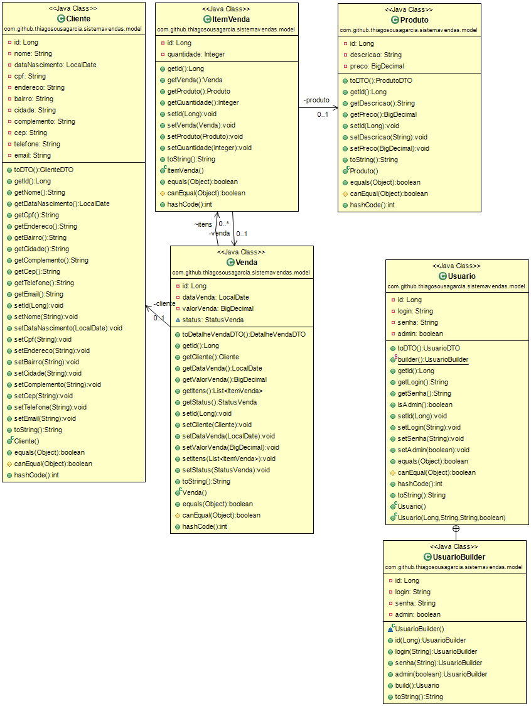
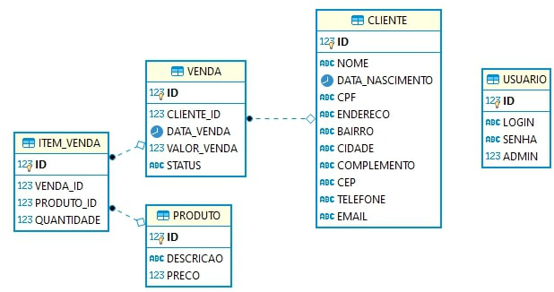

# API DE VENDAS
👨‍🏫APP DE SISTEMA DE VENDAS SIMPLES COM SPRING BOOT E SQL SERVER.

 <br>
 <br>

## DESCRIÇÃO:
O Projeto é uma API REST para um sistema de vendas simples, aplicando vários conceitos do ecossistema Spring. A API permite o gerenciamento de clientes, produtos, vendas e usuários, com funcionalidades de autenticação e autorização.

## COMO USAR?
### 1º PASSO: INICIAR O MICROSOFT SQL SERVER:
Abra o terminal e execute o seguinte comando para iniciar o Microsoft SQL Server:

```sh
docker run -d --name sqlserver2017 --restart=always -e "ACCEPT_EULA=Y" -e "SA_PASSWORD=DaTaBaSe6-3-3#TSG" -p 1401:1433 mcr.microsoft.com/mssql/server:2017-latest
```

### 2º PASSO: CRIAR A BASE DE DADOS:
Conecte-se ao SQL Server usando um gerenciador de banco de dados (como o DBeaver) e execute o seguinte script para criar a base de dados:

```sql
create database sistemaVendasDB
```

### 3º PASSO: EXECUTAR O PROJETO:
Abra o terminal, vá até a pasta do projeto e execute o seguinte comando:

```sh
mvn package spring-boot:run
```

## DOCUMENTAÇÃO DOS ENDPOINTS:
A documentação dos endpoints está disponível em: [Swagger UI](http://localhost:8095/sistema-vendas/swagger-ui.html)

## MAIS REFERENCIAS:
- [SPRING BOOT](https://github.com/VILHALVA/CURSO-DE-SPRING-BOOT)
- [API REST](https://github.com/VILHALVA/CURSO-DE-API-REST)
- [SPRING DATA](https://spring.io/projects/spring-data)
- [SPRING SECURITY](https://spring.io/projects/spring-security)
- [SQL SERVER](https://github.com/VILHALVA/CURSO-DE-SQL-SERVER)
- [MAVEN](https://maven.apache.org/)
- [LOMBOK](https://projectlombok.org)
- [FLYWAY](https://flywaydb.org/documentation)

## CREDITOS:
- [PROJETO CRIADO PELO "ThiagoSousaGarcia"](https://github.com/ThiagoSousaGarcia/sistema-vendas-spring)
- [PROJETO EDITADO PELO VILHALVA](https://github.com/VILHALVA)


